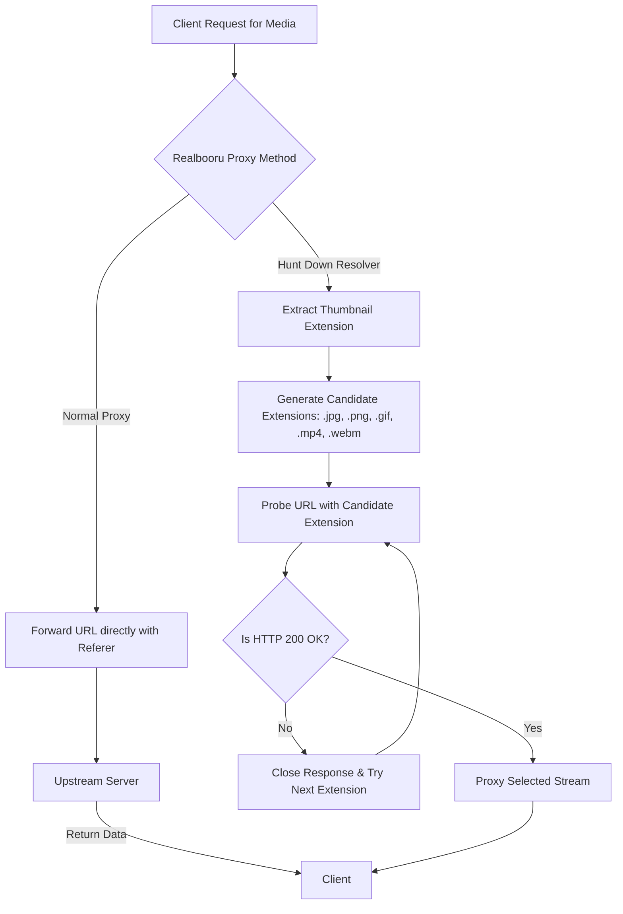

# Realbooru Media Proxy and Extension Resolver ("Hunt Down")

This document details the architecture and inner workings of the Media Proxy system implemented in Matoi, specifically focusing on the comparison between a **Standard Media Proxy** and the specialized **"Hunt Down" Media Proxy (Extension Resolver)** designed for the Realbooru imageboard.

---

## 1. Context and Problem Statement

Imageboards like Realbooru deploy hotlink protection to prevent external sites from directly embedding their media resources. This is typically done by validating the `Referer` or `User-Agent` HTTP headers. To allow clients to display these images/videos, Matoi routes requests through a local proxy endpoint.

However, Realbooru presents a secondary challenge:
* **No Offline API**: Realbooru's official XML/JSON API is offline.
* **HTML Scraping Limitation**: Matoi fetches posts by scraping the post list HTML page (`index.php?page=post&s=list`).
* **Unknown File Extensions**: The list page only exposes image thumbnails (which are always `.jpg`). It does not specify whether the original post is a static image (`.jpg`, `.png`, `.jpeg`), an animated image (`.gif`), or a video (`.mp4`, `.webm`).
* **Result**: We cannot directly determine the true file URL from the thumbnail layout alone.

---

## 2. Architectural Comparison



### Standard Media Proxy vs. "Hunt Down" Media Proxy

| Metric / Feature | Standard Media Proxy | "Hunt Down" Media Proxy (Realbooru) |
| :--- | :--- | :--- |
| **Input URL** | Direct known URL (e.g. from API responses). | Inferred/guess URL (derived from thumbnail paths). |
| **Probing Phase** | None. Single request executed. | Sequential probing of multiple common extensions. |
| **Headers Added** | `Referer` and `User-Agent` spoofing. | `Referer` and `User-Agent` spoofing + fast-fail connection tracking. |
| **Primary Goal** | Bypass hotlink checks. | Guess the correct file format **and** bypass hotlink checks. |

---

## 3. Detailed Mechanism

### A. Standard Media Proxy
A standard media proxy intercepts the client request, initiates an upstream request to the source server using the exact provided URL, appends the target site's address as the `Referer` header, and pipes the response body back to the client.

### B. "Hunt Down" Media Proxy (Extension Resolver)
The Realbooru implementation in `handlers/realbooru.go` utilizes an active probe-and-resolve pipeline (referred to as the "Hunt Down" mechanism).

1. **Extract Original Extension**:
   The resolver parses the guessed URL path and extracts the extension (usually `.jpg` from the thumbnail).
2. **Build Candidate Queue**:
   It compiles a slice of target extensions to probe:
   ```go
   extensionsToTry := []string{originalExt, ".jpg", ".png", ".gif", ".jpeg", ".mp4", ".webm"}
   ```
   *Duplicate extensions are automatically stripped to minimize redundant upstream requests.*
3. **Sequential Probing (The Hunt)**:
   For each unique extension in the list:
   * A new target URL is constructed (e.g., swapping `.jpg` with `.mp4`).
   * A lightweight HTTP request is initiated with:
     * `Referer: https://realbooru.com/`
     * Configured system `User-Agent`
     * 10-second request timeout
   * **Early Response Filtering**: If the upstream response is not `HTTP 200 OK`, the response body is instantly closed to prevent resource leakage, and the loop moves to the next candidate.
4. **Streaming and Client Delivery**:
   * The first candidate that responds with `HTTP 200 OK` halts the search.
   * The proxy sets the matching `Content-Type` header (copied from the upstream response).
   * It appends long-lived caching headers (`Cache-Control: public, max-age=31536000`).
   * The binary payload is read and streamed back to the client.

---

## 4. Code Snippet Reference

The core logic of the Realbooru Media Proxy is housed inside the `ProxyMedia` method in [handlers/realbooru.go](../handlers/realbooru.go#L200-L280):

```go
func (h *RealbooruHandler) ProxyMedia(c fiber.Ctx) error {
	targetURL := c.Query("url")
	// ... (URL parsing and validation) ...

	originalExt := path.Ext(parsedURL.Path)
	extensionsToTry := []string{originalExt, ".jpg", ".png", ".gif", ".jpeg", ".mp4", ".webm"}

	// ... (Deduplicate extensions) ...

	var resp *http.Response
	var body io.ReadCloser

	for _, ext := range uniqueExtensions {
		var testURL string
		if originalExt != "" {
			testURL = targetURL[:strings.LastIndex(targetURL, originalExt)] + ext
		} else {
			testURL = targetURL + ext
		}

		req, reqErr := http.NewRequestWithContext(context.Background(), http.MethodGet, testURL, http.NoBody)
		if reqErr != nil {
			continue
		}

		req.Header.Set("Referer", "https://realbooru.com/")
		// ... (Execute request and check for HTTP 200 OK) ...
		if r.StatusCode == http.StatusOK {
			resp = r
			body = r.Body
			break
		}
		_ = r.Body.Close() // Keep connections clean
	}

	// ... (Return payload with Content-Type and Cache-Control headers) ...
}
```

---

## 5. Performance and Resource Management

* **Connection Pool / Re-use**: The proxy uses Go's standard `http.Client` which automatically leverages connection pooling via Keep-Alive headers.
* **Fast Failure & Clean Close**: Every failed probe immediately executes `_ = r.Body.Close()`. This releases socket resources back to the pool instantly instead of waiting for garbage collection.
* **Client-Side Cache Control**: Since hunting down media is an expensive operation involving multiple upstream checks, Matoi injects `Cache-Control: public, max-age=31536000` (1 year). This guarantees that subsequent client loads serve directly from local browser or CDN caches, completely bypassing Matoi and Realbooru.
